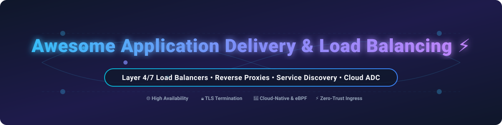

# Awesome Application Delivery & Load Balancing ⚡

  
  
  
  
  
  

A curated collection of production-grade **SaaS platforms** and **open-source GitHub projects** focused on **Layer 4 / Layer 7 load balancing**, **reverse proxies**, **service discovery**, **API gateways**, **eBPF ingress**, and **Application Delivery Controllers (ADC)**.

---

## 📚 Table of Contents
- [🌐 Market Size & Industry Dynamics](#-market-size--industry-dynamics)
- [☁️ SaaS & Hosted Commercial Platforms](#️-saas--hosted-commercial-platforms)
- [🛠️ Open-Source GitHub Projects](#️-open-source-github-projects)
  - [🚀 High-Performance & General Purpose Load Balancers](#-high-performance--general-purpose-load-balancers)
  - [☁️ Cloud-Native & Container Ingress](#️-cloud-native--container-ingress)
  - [☸️ Kubernetes & Bare-Metal Load Balancers](#️-kubernetes--bare-metal-load-balancers)
  - [🛡️ Enterprise ADC Platforms](#️-enterprise-adc-platforms)
- [🤝 How to Contribute](#-how-to-contribute)
- [💖 Support](#-support)
- [⚠️ Disclaimer](#️-disclaimer)
- [⭐ Star History](#-star-history)

---

## 🌐 Market Size & Industry Dynamics

> [!NOTE]
> The global **Application Delivery Controller (ADC) and Load Balancing market** is valued at approximately **$4.8 Billion USD (2025/2026)** and is projected to expand to **$9.2 Billion USD by 2032** at a CAGR of **~9.5%**. 
> 
> **Market Structure:** The sector is **moderately fragmented**. Top tier hyperscalers (Microsoft Azure, AWS, Google Cloud) and established cloud giants (Cloudflare, F5 Networks) control the enterprise cloud and hardware ADC segments. However, a thriving and highly competitive ecosystem of specialized cloud-native proxies and open-source solutions (HAProxy, NGINX, Envoy, Traefik, Caddy) prevents a single "winner-take-all" outcome, allowing developers and DevOps architects to choose specialized solutions for microservices, bare-metal Kubernetes, and edge networks.

---

## ☁️ SaaS & Hosted Commercial Platforms

Below is a comparison of top-tier commercial Application Delivery Controllers and managed cloud load balancing products sorted by company size (Revenue / Valuation).

| Product 🛠️ | Vendor / Company 🏢 | Market Size / Valuation 📊 | Pricing (Starting Paid Tier) 💰 | Free Tier / Trial Limits 🎁 | Primary Use Cases & Features 🌟 |
| :--- | :--- | :--- | :--- | :--- | :--- | | **Azure Application Gateway** | Microsoft | **$3.12 Trillion (Market Cap)** | ~$0.025/hour + $0.008 per Capacity Unit (~$18/month base) | 30-day trial with $200 Azure free credits | Managed Layer 7 load balancer with Web Application Firewall (WAF), URL routing, & AKS integration. |
| **Google Cloud Load Balancing** | Alphabet (Google) | **$2.05 Trillion (Market Cap)** | ~$0.025/hour (~$18/month for first 5 forwarding rules) + data egress | $300 credit for 90 days; free tier includes select GCE/GKE usage | Global Anycast IP load balancing, cross-region failover, Cloud CDN & Cloud Armor WAF integration. |
| **AWS Application Load Balancer (ALB)** | Amazon (AWS) | **$1.98 Trillion (Market Cap)** | ~$0.0225/hour + $0.008 per LCU (~$16.20/month base) | 12 months free: 750 hours/month shared with ALB/NLB + 15 LCU | Cloud-native L7 load balancer for HTTP/HTTPS/gRPC, host/path routing, ECS/EKS integration. |
| **Cloudflare Load Balancing** | Cloudflare | **$34.5 Billion (Market Cap)** | $5/month (includes 2 origin servers & 6 pool monitors) | Free tier available (DNS/CDN), Load Balancing starts at $5/mo with active health check limits | Global traffic steering, active health monitoring, geo-routing, and built-in DDoS protection. |
| **Citrix ADC (NetScaler)** | Cloud Software Group | **$16.5 Billion (Acquisition Value)** | ~$2,500/year (VPX virtual appliance entry license) | 90-day trial license for NetScaler VPX Express (20 Mbps limited) | Enterprise ADC with high-density SSL offloading, application acceleration, and bot management. |
| **F5 BIG-IP** | F5 Networks | **$13.2 Billion (Market Cap)** | ~$1,800/year (BIG-IP VE pay-as-you-go / subscription base) | 90-day free trial for BIG-IP Virtual Edition (VE) with evaluation key | Enterprise-grade ADC platform, high-throughput hardware/VE, GSLB, and advanced WAF protection. |
| **Fastly Load Balancing** | Fastly | **$1.15 Billion (Market Cap)** | $50/month (Essential plan minimum platform spend) | $50 one-time credit free trial for edge compute & load balancing | Edge load balancing integrated directly with Fastly edge CDN and Compute@Edge runtime. |
| **NGINX Plus** | F5 / NGINX | **$670 Million (F5 Acquisition)** | ~$2,500/year per instance | 30-day full-featured free trial with official NGINX support | Commercial NGINX edition adding active health checks, JWT auth, dynamic configuration, and live state APIs. |
| **Kemp LoadMaster** | Progress Software (Kemp) | **$2.8 Billion (Progress Market Cap)** | ~$1,980 (One-time perpetual entry VLM license) | Free LoadMaster (FLM) perpetual tier capped at 20 Mbps throughput | Simple, cost-effective ADC with virtual/hardware appliances, SSL offloading, and easy GUI management. |
| **HAProxy Enterprise** | HAProxy Technologies | **~$150 Million (Est. Valuation)** | ~$1,200/year per node (Enterprise Base Subscription) | 30-day trial of HAProxy Enterprise with all modules enabled | Commercial HAProxy distribution featuring enterprise WAF, bot defense, Real-Time Dashboard, and 24/7 SLA. |

---

## 🛠️ Open-Source GitHub Projects

The open-source application delivery ecosystem contains the world's most performant, battle-tested reverse proxies and ingress controllers. Projects below are sorted by **GitHub Star Count (descending)**.

### 🚀 High-Performance & General Purpose Load Balancers

-  **[NGINX](https://github.com/nginx/nginx)** (BSD-2-Clause) - The world's most widely deployed web server and L4/L7 reverse proxy. Powers ~33% of all internet websites with efficient event-driven architecture.
-  **[Caddy](https://github.com/caddyserver/caddy)** (Apache-2.0) - Modern, memory-safe web server written in Go featuring **automatic HTTPS** via Let's Encrypt/ZeroSSL, HTTP/3 support, and simple Caddyfile syntax.
-  **[Envoy Proxy](https://github.com/envoyproxy/envoy)** (Apache-2.0) - High-performance C++ L7 proxy and service bus designed for cloud-native architectures. Serves as the default data plane for Istio, Linkerd, and modern service meshes.
-  **[HAProxy](https://github.com/haproxy/haproxy)** (GPL-2.0) - The ultimate performance leader in open-source L4/L7 load balancing. Capable of handling over 40,000 requests/sec per core with ultra-low CPU overhead and microsecond latency.

### ☁️ Cloud-Native & Container Ingress

-  **[Traefik](https://github.com/traefik/traefik)** (MIT) - The premier cloud-native HTTP reverse proxy and load balancer with automatic service discovery for Docker, Kubernetes, Consul, and Swarm.
-  **[OpenResty](https://github.com/openresty/openresty)** (BSD-2-Clause) - Full-fledged web platform integrating NGINX with LuaJIT to enable ultra-fast, scriptable L7 traffic management, dynamic routing, and custom security rules.
-  **[BFE (Baidu Front End)](https://github.com/baidu/bfe)** (Apache-2.0) - Modern Go-based Layer 7 load balancing platform handling context-aware routing, memory safety, and high-concurrency multi-tenant traffic routing.

### ☸️ Kubernetes & Bare-Metal Load Balancers

-  **[MetalLB](https://github.com/metallb/metallb)** (Apache-2.0) - Bare-metal network load balancer implementation for Kubernetes clusters using standard network routing protocols (ARP, NDP, BGP).
-  **[kube-vip](https://github.com/kube-vip/kube-vip)** (Apache-2.0) - Virtual IP and Load Balancing solution for Kubernetes control planes and services in bare-metal, edge, and hybrid environments.
-  **[LoxiLB](https://github.com/loxilb-io/loxilb)** (Apache-2.0) - High-performance cloud-native Layer 4 / Layer 7 eBPF-based load balancer tailored for Kubernetes, 5G Telco, IoT, and edge workloads.

### 🛡️ Enterprise ADC Platforms

-  **[RELIANOID Community Edition](https://github.com/relianoid/relianoid)** (AGPL-3.0) - Formerly ZEVENET, a Debian-based open-source Application Delivery Controller (ADC) for L4/L7 load balancing, high availability, and network security.

---

## 🤝 How to Contribute

Contributions are welcome! To contribute:

1. 🍴 **Fork** this repository.
2. 📝 **Add or update** entries in `README.md` keeping descriptions factual and neutral.
3. 🧪 Ensure links, star badges, and markdown tables format properly.
4. 🚀 Open a **Pull Request** with a brief summary of your changes.

---

## 💖 Support

If you found this repository helpful for your infrastructure or DevOps architecture:

- ⭐ **Star this repository** to help others discover it!
- 🔀 **Fork it** to customize it for your team's internal technical stack.
- 📢 **Share it** with fellow developers, SREs, and network engineers.
- 💖 Consider sponsoring the maintainer on [GitHub Sponsors](https://github.com/sponsors/ishandutta2007).

Thank you for supporting open-source software! 🙌

---

## ⚠️ Disclaimer

This list is community-curated for informational and educational purposes only and does not constitute an endorsement. Load balancers handle critical production traffic and TLS termination; always verify security configurations, cipher suites, and compliance requirements before deployment.

---

## ⭐ Star History

